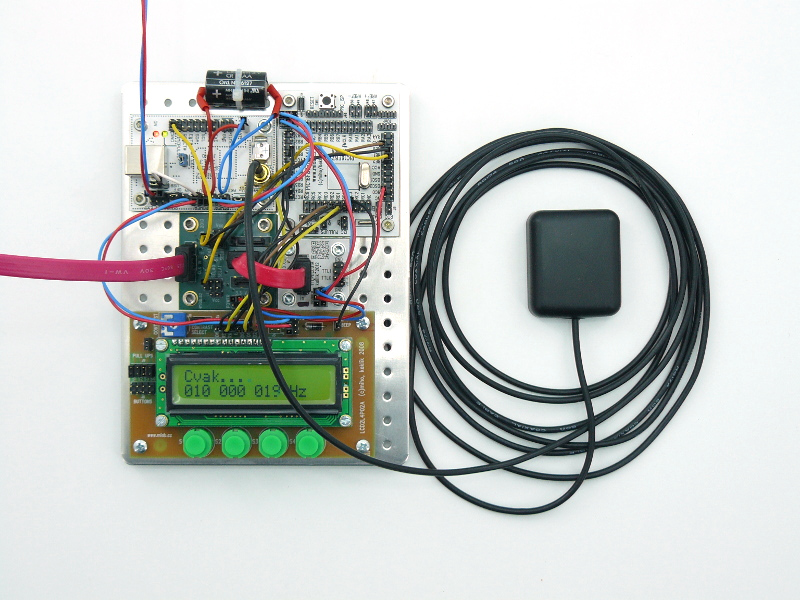

# ACOUNTER02 - Atomic frequency  Counter with PIC microcontroler
 
The frequency counter up to 800 MHz synchonised by GPS with 0.1 ppm accuracy. Frequency range can be expanded by adding additional divider module (CLKDIV01A). 

Měřič frekvence do 800 MHz opřený o kmitočtový normál GPS s přesností 0.1 ppm. Frekvenční rozsah může být rozšířen přidáním další předděličky (CLKDIV01A).

